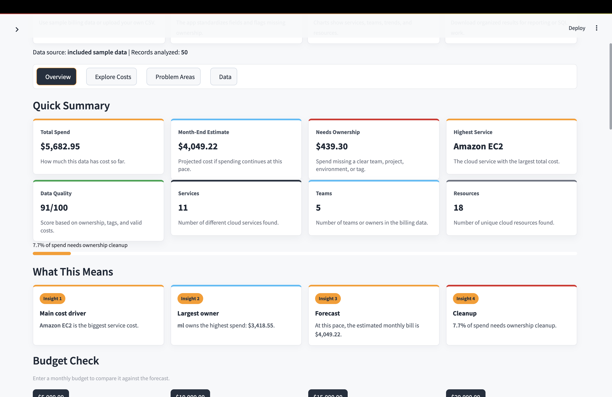
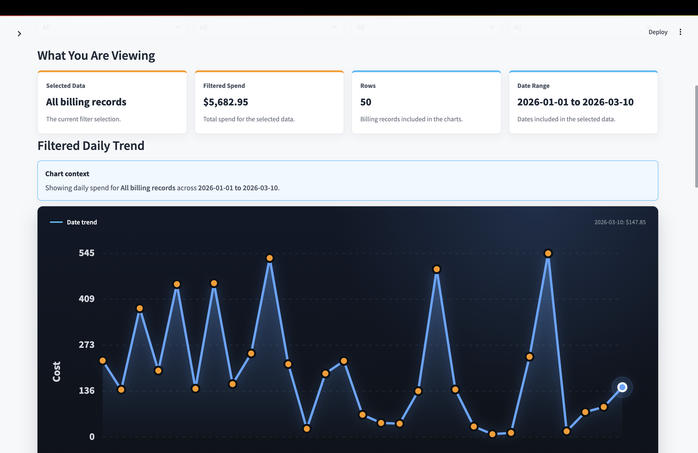
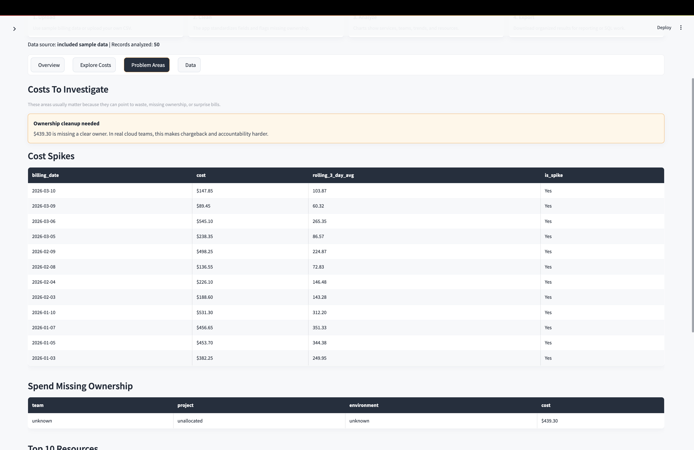
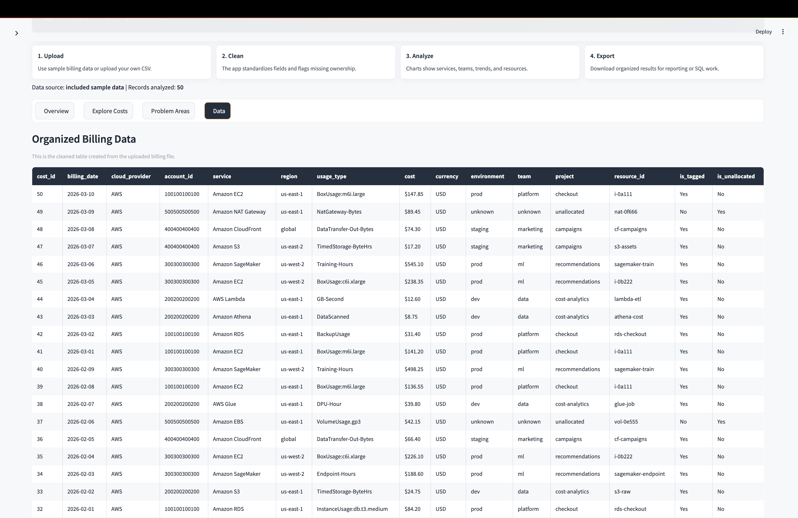

# Cloud Cost Analytics Pipeline

A cloud cost analytics dashboard built for cloud engineering and data analyst portfolio use. The project processes AWS-style billing data, models it into analytics-ready tables, and visualizes spend trends, ownership gaps, budget variance, and cost spikes in a Streamlit dashboard.

## Live Demo

[Open the Cloud Cost Analytics Dashboard](https://cloud-cost-analytics-pipeline-jhusqf4lp4yfcqyevroawy.streamlit.app/)

## What This Project Does

- Uploads and validates cloud billing CSV files.
- Cleans raw billing records into consistent analytics fields.
- Builds fact, dimension, daily summary, monthly summary, and budget variance tables.
- Stores processed outputs as CSV files and in SQLite.
- Shows cost trends, top services, team spend, unallocated spend, and budget status.
- Supports SQL analysis, local ETL runs, optional S3 input, Terraform infrastructure, and alert reporting.

## Dashboard Highlights

- **Overview:** total spend, month-end forecast, ownership cleanup, top service, data quality, and budget check.
- **Explore Costs:** filters by team, project, environment, and service.
- **Problem Areas:** daily spikes, unallocated spend, and top resources to investigate.
- **Alerts:** adjustable thresholds, generated alert reports, and optional Slack/email delivery.
- **Data:** cleaned billing data with export support.
- **Charts:** custom animated SVG charts with readable labels, live-style panels, and instant tooltips.

## Screenshots

### Overview



### Explore Costs



### Problem Areas



### Organized Data



## Tech Stack

- **Python:** ETL, data cleaning, validation, alert logic
- **Pandas:** data transformations and summary tables
- **SQLite:** local analytics database
- **SQL:** reusable analysis queries
- **Streamlit:** interactive dashboard
- **Terraform:** AWS infrastructure blueprint
- **AWS-ready components:** S3 input support, SNS alert topic design, IAM role design

## Architecture

```text
Raw billing CSV or S3 object
        |
        v
etl/process_billing_data.py
        |
        +--> fact_cloud_costs
        +--> dim_date
        +--> dim_service
        +--> dim_team
        +--> daily_spend_summary
        +--> monthly_spend_summary
        +--> team_budget_variance
        +--> executive_summary
        |
        +--> CSV outputs in data/processed/
        +--> SQLite database in data/processed/cloud_costs.db
        |
        v
Streamlit dashboard + SQL analysis + alert reporting
```

## Data Questions Answered

- Which services drive the most cloud spend?
- Which teams and projects own the highest costs?
- How much spend is missing ownership or tags?
- Are there daily cost spikes?
- What is the projected month-end bill?
- How is spend changing month over month?
- Which teams are over, near, or under budget?

## Run Locally

Clone the repo, create a virtual environment, install dependencies, run the ETL, and start the dashboard:

```bash
git clone <repository-url>
cd cloud-cost-analytics-pipeline
python3 -m venv .venv
source .venv/bin/activate
pip install -r requirements.txt
python etl/process_billing_data.py
streamlit run dashboard/app.py
```

Then open the local Streamlit URL shown in your terminal, usually:

```text
http://localhost:8501
```

If that port is busy, Streamlit may use another port such as `8502`.

## CSV Upload Format

The dashboard accepts CSV files with these columns:

```text
account_id
billing_date
cloud_provider
cost
currency
environment
project
region
resource_id
service
tags
team
usage_type
```

If you do not have a file ready, the dashboard loads included sample data automatically. The sidebar also includes a **Download CSV Template** button.

## Command-Line Usage

Run the ETL with the included sample data:

```bash
python etl/process_billing_data.py
```

Run the ETL with a local CSV:

```bash
python etl/process_billing_data.py --input path/to/billing.csv
```

Run the ETL with an S3 object after configuring AWS credentials:

```bash
python etl/process_billing_data.py --input s3://your-bucket/path/to/billing.csv
```

Run tests:

```bash
python3 -m unittest discover -s tests
```

Check SQL files against the generated SQLite database:

```bash
make sql-check
```

## Budget Variance

Team budget targets are stored in:

```text
config/team_budgets.csv
```

The ETL compares actual monthly spend against each team budget and creates:

```text
data/processed/team_budget_variance.csv
```

The dashboard uses this output to show budget status and variance by team.

## Alerts

Generate a local cost alert report:

```bash
python alerts/send_alerts.py
```

Send alerts to Slack by setting:

```bash
export SLACK_WEBHOOK_URL="https://hooks.slack.com/services/..."
python alerts/send_alerts.py
```

Email alerts are also supported through SMTP environment variables:

```text
SMTP_HOST
SMTP_USERNAME
SMTP_PASSWORD
ALERT_EMAIL_FROM
ALERT_EMAIL_TO
```

## Terraform

The `terraform/` folder provides an AWS infrastructure blueprint for a cloud version of the pipeline:

- Raw billing S3 bucket
- Curated analytics S3 bucket
- SNS topic for alerts
- IAM role and policy for a future Lambda or scheduled ETL job

Preview the infrastructure:

```bash
cd terraform
terraform init
terraform plan
```

## Project Structure

```text
cloud-cost-analytics-pipeline/
├── alerts/
│   └── send_alerts.py
├── config/
│   └── team_budgets.csv
├── dashboard/
│   └── app.py
├── data/
│   ├── raw/
│   └── processed/
├── docs/
│   └── architecture.md
├── etl/
│   └── process_billing_data.py
├── sql/
├── terraform/
├── tests/
├── requirements.txt
└── README.md
```
